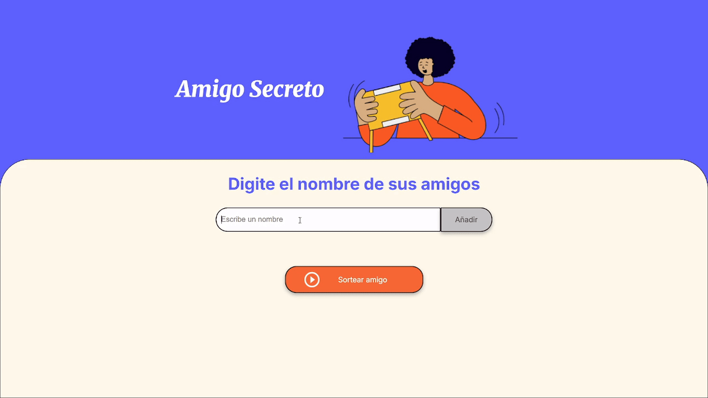

<h1 align="center">dardogithub</h1>

<p align="center">
  
</p>

---
</p>
<p align="center">
  <a href="#Caracteristicas">Caracteristicas</a> •
  <a href="#instalacion-y-uso">Instalacion y Uso</a> •
  <a href="#demostracion">demostracion</a> •
  <a href="#creditos">creditos</a> •
</p>
<p align="center">
  
# Proyecto: Amigo Secreto 

<table>
  <tr>
    <td>
      
    </td>
    <td>
      <ol>
        <li>
          <strong>Descripción:</strong>  
          Aplicación web para realizar un sorteo de Amigo Secretos.  
          Permite agregar nombres a una lista, validarlos y mostrar el resultado del sorteo de forma aleatoria.
        </li>
        <li>
          <strong></strong>  
          
        </li>
        <li>
          <strong>Tecnologías:</strong> HTML, CSS, JavaScript (ES6)
        </li>
      </ol>
    </td>
  </tr>
</table>


---

## Caracteristicas

- Interfaz simple y facil de usar
- Permite agregar nombres de forma rápida
- Validacion automatica de datos
- Visualización clara de la lista de participantes
- Sorteo aleatorio con un solo clic

---

## Instalacion y Uso

### Instalación

Sigue estos pasos para instalar y ejecutar el proyecto en tu máquina local:

1. Clona este repositorio:
   ```
   git clone https://github.com/dardogithub/challenge-amigo-secreto_esp-main.git
2. Abre la carpeta del proyecto.
3. Abre el archivo index.html en tu navegador.

### Uso

1. Ingresa un nombre en el campo de texto.
3. Haz clic en "Adicionar" para agregarlo a la lista.
4. Repite hasta añadir todos los nombres.
5. Presiona "Sortear Amigo" para mostrar el resultado.

---

## Demostracion

<p align="center">
  

</p>                   

<p align="center">
  
## Creditos

<div style="border: 2px solid #ccc; border-radius: 8px; padding: 20px; margin: 20px auto; max-width: 700px; background-color: #fafafa;">

  <h3 style="text-align: center;">Instructores</h3>
  <p style="text-align: center; max-width: 600px; margin: 0 auto 20px auto;">
    Agradecemos especialmente a los siguientes instructores por la guía y soporte en el aprendizaje.
  </p>
  <p style="text-align: center; margin-bottom: 40px;">
    <a href="https://github.com/christianpva" target="_blank" style="display: inline-block; margin: 0 8px;">
      
    </a>
    <a href="https://github.com/ljcl79" target="_blank" style="display: inline-block; margin: 0 8px;">
      
    </a>
    <a href="https://github.com/Ellen-code" target="_blank" style="display: inline-block; margin: 0 8px;">
      
    </a>
    <a href="https://www.linkedin.com/in/gabyaguiar/" target="_blank" style="display: inline-block; margin: 0 8px;">
      
    </a>
    <a href="https://www.linkedin.com/in/priscilastuani/" target="_blank" style="display: inline-block; margin: 0 8px;">
      
    </a>
  </p>

  <h3 style="text-align: center;">Organizaciones</h3>

<div style="display: flex; align-items: center; justify-content: center; margin-bottom: 15px;">
  <a href="https://www.linkedin.com/school/alura-latam/?originalSubdomain=br" target="_blank" style="display: inline-block; margin-right: 15px;">
    
  </a>
  <span style="color: #444444; font-style: italic; user-select: none; white-space: nowrap; font-size: 14px;">
    [Alura LATAM] — por brindar una formación de alta calidad en tecnología y desarrollo web.
  </span>
</div>

<div style="display: flex; align-items: center; justify-content: center;">
  <a href="https://www.oracle.com/latam/education/oracle-next-education/" target="_blank" style="display: inline-block; margin-right: 15px;">
    
  </a>
  <span style="color: #444444; font-style: italic; user-select: none; white-space: nowrap; font-size: 14px;">
    [ONE Oracle Next Education] — por impulsar la innovación y facilitar empleo en tecnología.
  </span>
</div>

